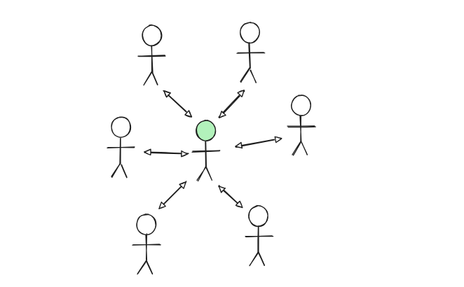
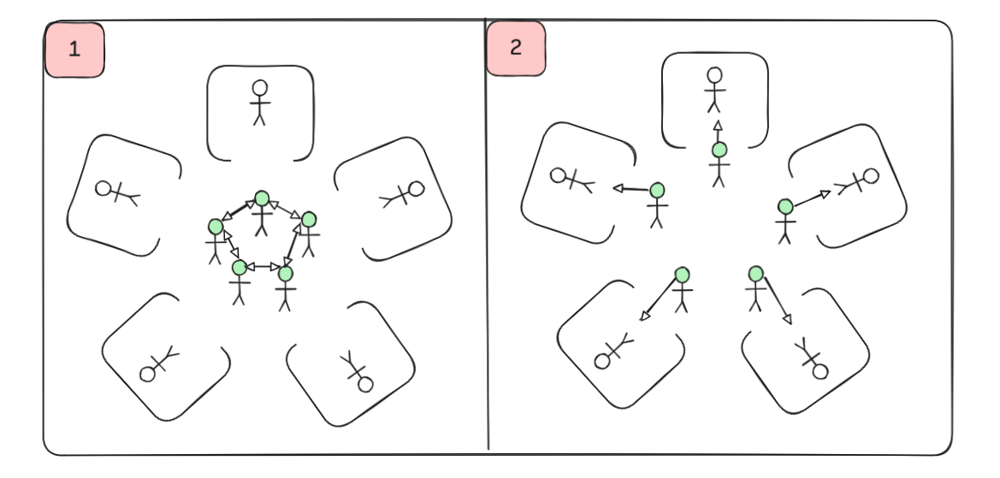
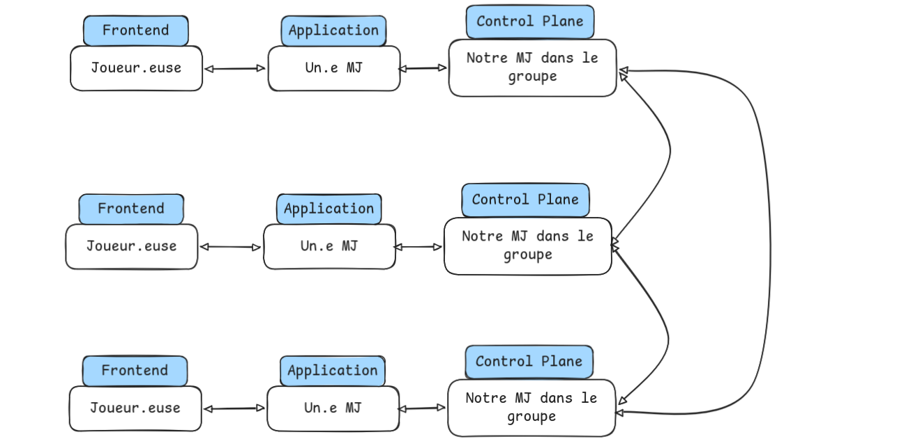
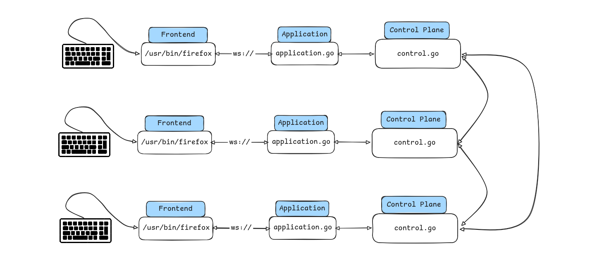

# SR05 - Projet

## TODO : suppr une fois le projet terminé

### Proposition d'architecture du système

Navigateur <(Websocket)> server.go <(chan/std)> application.go <(chan/std)> control.go
^ |
| ⌄
Navigateur <(Websocket)> server.go <(chan/std)> application.go <(chan/std)> control.go

### Proposition d'organisation du projet

Pour info : j'ai commencé à créer des fichiers un peu au piff histoire de pouvoir push les dossiers, mais c'est à revoir

```bash
* cmd/
  * application/
    * main.go       # Lance l'application (créé un logger, un io, et on lance internal/application)
  * control/
    * main.go       # Lance le contrôle (créé un logger, un io, et on lance internal/control)
  * server/
    * main.go       # Lance le serveur (créé un logger, un io, et on lance internal/server)
* internal/
  * application/
    * app.go        # Contient la logique principale de l'application
    * filter.go     # Forme un filtre sur ce que l'on souhaite forward ou non au server (ce que le joueur a le droit de voir ou pas)
    * state.go      # Contient les structures de données représentant l'état du jeu côté application
  * control/
    * control.go    # Contient la logique principale du centre de contrôle
    * state.go      # Contient les structures de données représentant l'état du jeu côté centre de contrôle
    * <horloge.go, snapshot.go...> Enfin bref ce qui est demandé pour le projet
  * server/
    * server.go     # Gère le serveur (pour communiquer via ws avec un navigateur)
* pkg/
  * logger/
    * logger.go     # Logger mis en forme (couleur, nom des processus, PID, etc.)
  * transport/
    * io.go         # Gère la lecture sur stdin et écriture sur stdout
    * messages.go   # Gère la construction et lectures des messages envoyés/reçus
* web/
  * index.html
  * ...
* scripts/
  * 4-ring.sh
  * 5-mesh.sh
  * 7-ring_with_ctl.sh
  * ...
```

### Consignes à garder en tête (pas encore implémentées)

- Les programmes communiquent par stdin et stdout.... Pour tout le reste on utilise stderr
- On sépare le code de "controle" du code de "l'application"
  - Le code de "controle" intercèpte les messages de l'application et réalise un contrôle (par exemple l'estampillage)

## Prémisses

> _Choix étrange d'avoir choisi le jeu du loup-garou pour modéliser une application répartie..._

Effectivement, de prime abord le jeu du loup-garou est un jeu extrêmement centralisé (difficile de faire plus centralisé même) :

- un.e maître.sse du jeu ("MJ") a la totale connaissance du jeu,
- les joueurs.euses n'ont cependant aucune connaissance,
- seul.e le.a MJ s'occupe d'appliquer les règles
- et iel chosit quand est-ce que l'on passe d'une phase du jeu à une autre



Cependant, si on change un peu notre façon de voir les choses, on peut imaginer un système réparti.

### Une nouvelle façon de voir le jeu

Au lieu de visualiser le jeu comme on peut avoir l'habitude d'y jouer, avec tou.te.s les participant.e.s en cercle et le.a MJ au centre, on va plutôt se placer dans une autre configurations :

- Chacun.e des participant.e.s est placé.e dans une pièce isolée (1 participant.e par pièce)
- On possède autant de MJ que de participant.e.s
- A chaque phase, les MJ se réunissent et décident de l'état actuel du jeu et de quelle règle appliquer
- Ensuite, chacun.e retourne voir son.a participant.e pour l'informer de l'état du jeu
- A chaque changement dans l'état du jeu (un.e participant.e a vôté pour quelqu'un, fin du phase du jeu, etc.), tou.te.s les MJ se réunissent pour se partager l'information et décider de quoi faire.



On se retrouve alors dans un cadre très particulier du loup-garou : un loup-garou décentralisé entre $n$ MJ

### D'un point de vue implémentation

D'un point de vue implémentation, cette vision du jeu colle plutôt bien avec l'architecture proposée dans l'énoncé, à savoir que chaque machine fait un "centre de controle", une application, ainsi qu'un frontend.

- Le centre de controle fait alors parti du système réparti (c'est l'ensemble des MJ qui communiquent),
- L'application s'occupe de mettre en forme le jeu et filtrer les informations (chaque MJ met en forme son discours pour communqiuer avec son.a participant.e attribué.e et ne pas révéler le rôle d'un.e autre participant.e),
- Et finalement notre frontend représente notre participant.e qui joue

#### Architecture du système d'un point de vue physique



#### Architecture du système d'un point de vue virtuel (code)



## Rappel des consignes

Le projet porte sur la création d'une application répartie respectant les contraintes suivantes :

- L'application répartie utilise une donnée partagée entre les sites
  - Définir un scénario qui nécessite le partage d'au moins une donnée entre plusieurs "sites" : les instances de l'application réparties s'exécutant sur chaque site travaillent sur des réplicats qui sont des copies locales de la donnée partagée.
- Les réplicats restent cohérents
  - N'autoriser qu'une seule modification de réplicat à la fois et propager les modifications aux autres réplicats.
  - Implémenter pour cela l'algorithme de la file d'attente répartie qui organise une exclusion mutuelle. La section critique correspond à l'accès exclusif à la donnée. À vous de voir s'il faut une exclusion mutuelle pour l'écriture et la lecture de la donnée partagée. À vous de voir comment adapter l'algorithme pour diffuser la mise à jour de la donnée partagée.
  - Cet algorithme utilise lui-même les estampilles, qu'il est donc nécessaire d'implémenter.
- L'application répartie inclut une fonctionnalité de sauvegarde répartie datée
  - Implémenter pour cela un algorithme de calcul d'instantanés du cours.
  - Pour dater la sauvegarde, utiliser des horloges vectorielles.
- L'application répartie est clairement structurée
  - Utiliser une architecture qui distingue les fonctionnalités applicatives des fonctionnalités de contrôle.
  - Définir au moins un réseau convaincant pour les tests.

## Modélisation d'un état du jeu

```yaml
phase: LG # LG / SORCIERE / VOTE

joueurs:
  J1:
    ip: 198.0.0.1
    port: 40067
    role: WOLF # WOLF / VILLAGER / WITCH
    alive: false
  J2:
    ip: 198.0.0.2
    port: 40068
    role: WOLF
    alive: false
  J3:
    ip: 198.0.0.3
    port: 40069
    role: VILLAGER
    alive: true
  J4:
    ip: 198.0.0.4
    port: 40070
    role: VILAGER
    alive: true
  J5:
    ip: 198.0.0.5
    port: 40071
    role: WITCH
    alive: true

votes:
  J1: J3
  J2: J3
  J3: J1

kills:
  wolf: J1
  witch: J2
```
